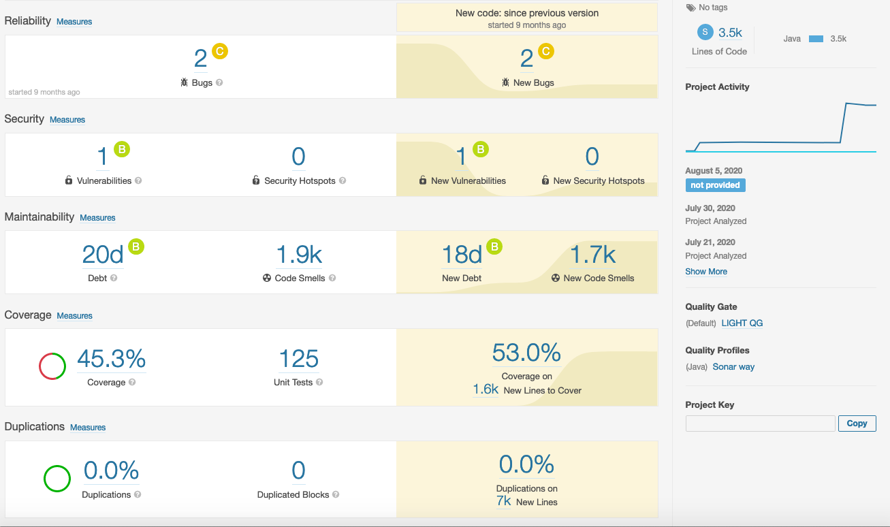

# **Desafio QA**


**LEIA COM MUITA ATENÇÃO AS INSTRUÇÕES A SEGUIR**

- Este desafio é composto por 5 questões e é importante que você responda a todas elas ou ao máximo que conseguir. 
- As respostas devem ser entregues por meio deste repositório e as operações realizadas nele serão observadas em avaliação da sua familiaridade com Git. 
- Não serão aceitas respostas enviadas em arquivos compactados, enviados por e-mail ou qualquer outro meio que não seja este repositório. 
- Para as questões que exigem implementação de código, organize os códigos para que eles possam ser executados através de linha de comando, em um terminal não gráfico. Não escreva códigos que dependam de IDEs de programação ou ferramentas gráficas para a sua execução ou compilação. 
- Assuma que a sua avaliação será executada num ambiente similar ao nosso CI/CD e rodará em SO Linux, não em Windows. Por tanto, se for incluir dependências que estejam vinculadas ao SO, indique ou forneça as versões apropriadas para Linux.
- Caso esteja familiarizado, o docker e o docker-compose podem ajudá-lo a montar um ambiente controlado para a execução dos seus códigos. O uso dessas tecnologias não é exigido, mas será considerado como um diferencial na avaliação do candidato. 
- Para a entrega final, é importante que todos os artefatos necessário à avaliação das suas respostas estejam salvos neste repositório, com exceção de pacotes de dependência de bibliotecas e imagens docker que por ventura estejam disponíveis através de repositórios públicos e cujos comandos para download esteja em algum dos scripts pertencentes à resposta.
- A resposta de cada questão deve estar salva num arquivo ou diretório separado e conter todas as orientações necessárias para sua execução e avaliação.
- Como candidato a uma vaga de Engenheiro de Qualidade, é esperado que os seus códigos sejam organizados, limpos e baseados em boas práticas de programação.
- Para todas as questões, tenha atenção ao que é pedido no enunciado das mesmas e à clareza das suas respostas, a sua capacidade de comunicação estará sendo avaliada. 


  

## **Questão 1:**

  

Abaixo apresentamos um screenshot da análise de uma aplicação fictícia, feita através da ferramenta Sonarqube. Com base nas métricas apontadas na imagem, quais são os principais problemas identificados e quais práticas você recomendaria ao time de desenvolvimento para melhorar a qualidade da aplicação? 

 

---

  

## **Questão 2:**

  

Imagine que você é o profissional encarregado por garantir a qualidade em um time que constrói um software para recomendação de filmes disponíveis em várias ferramentas de stream. A aplicação deveria possuir um algoritmo de busca fonética para permitir buscar filmes mesmo que o candidato cometesse erros ortográficos, ou buscar títulos cuja sonoridade dos nomes fosse similar. Nos casos em que um título fosse encontrado com precisão, apenas ele deveria ser exibido no resultado. Nos casos em que a busca fonética identificasse mais de um candidato, todos deveriam ser exibidos. Em casos onde os títulos não fossem encontrados, títulos populares deveriam ser exibidos, refinados de acordo com o gosto do usuário. Imagine também que, durante uma execução de teste, representada pela tela abaixo, você percebeu que o resultado estava fora do esperado. Liste os erros que você consegue identificar na tela de resultado (não é necessário explicar cada erro em detalhes) e escreva um texto com o relato de um dos erros, como se você estivesse relatando a falha para o time de desenvolvimento através de uma ferramenta de tickets (ex. Jira). Foque na clareza e objetividade do relato.

  


---

  

## **Questão 3:**

  

Utilizando a ferramenta [ServeRest](https://github.com/PauloGoncalvesBH/ServeRest) e utilizando a API que ela disponibiliza, defina pelo menos 2 cenários de teste e implemente-os de forma automatizada. Você é livre para escolher o framework de testes e linguagem de programação, mas lembre-se que a solução deve contemplar o uso da ServeRest. Não é necessário validar todos os atributos da resposta da API, mas os itens validados devem estar em conformidade com o cenário descrito. A solução do desafio deve conter instruções completas de como executar os testes.

---

  

## **Questão 4:**

  

Analise o código abaixo e informe qual a complexidade ciclomática e quantos testes de unidade seriam necessários para atingir 100% de cobertura (assumindo que cada teste cobrisse apenas um ramo de execução). Não é necessário ter entendimento da funcionalidade do código ou da linguagem de programação na qual ele foi escrito. Não é necessário explicar quais ramos de execução seriam testados. 

  

```

function complexFunction(accountingCalculator, company, m_employee) {
	for (id = 0; id < numEmployees; id++) {
		// compute social security withholding, if bellow the maximum
		if ( m_employee[id].governmentRetirementWithheld < MAX_GOVT_RETIREMENT ) {
			governmentRetirement = accountingCalculator.computeGovernmentRetirement(m_employee[id]);
		}

		// set default to no retirement contribution
		companyRetirement = 0;

		// determine discretionary employee retirement contribution
		if (m_employee[id].wantsRetirement 
			&& accountingCalculator.eligibleForRetirement(m_employee[id]) ) {
			companyRetirement = company.getRetirement(m_employee[id]);
		}

		grossPay = accountingCalculator.computeGrossPay(m_employee[id]);

		// determine IRA contribution
		personalRetirement = 0;

		if (accountingCalculator.eligibleForPersonalRetirement(m_employee[id])) {
			personalRetirement = accountingCalculator.personalRetirementContribution(m_employee[id],
				companyRetirement, grossPay);
		}

		withHolding = accountingCalculator.computeWithHolding(m_employee[id]);
		netPay = grossPay - withHolding - companyRetirement - 
			governmentRetirement - personalRetirement;
		payEmployee(m_employee[id], netPay);

		// add this employee's paycheck to total for accounting
		totalWithHoldings = totalWithHoldings + withHolding;
		totalGovernmentRetirement = totalGovernmentRetirement + governmentRetirement;
		totalRetirement = totalRetirement + companyRetirement;
	}
	savePayRecords(totalWithHoldings, totalGovernmentRetirement, totalRetirement);
}

```

---

  

## **Questão 5:**

  

Crie um cenário de teste e um projeto de automação a partir do site [automationpractice.com](http://automationpractice.com/). O cenário deve ser criado utilizando BDD, mas pode ser escrito na linguagem de programação de sua preferência. Você é livre para escolher a funcionalidade a ser testada, porém, a resposta deve envolver tanto a descrição do cenário, como a implementação do mesmo.

---
